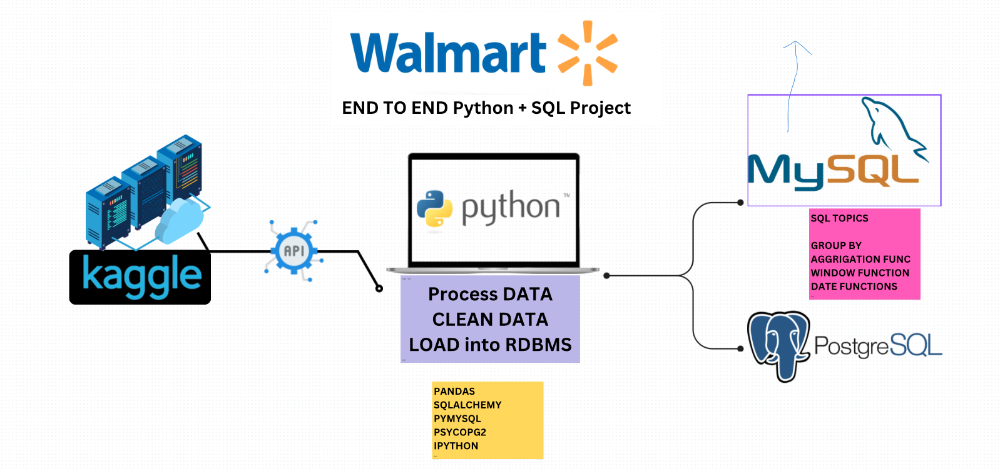

# 🛒 Walmart Data Analysis: End-to-End SQL + Python Project

## 📊 Project Overview



This project is a **comprehensive, real-world data analytics solution** designed to extract critical business insights from Walmart sales data. Perfect for beginners and professionals alike, it demonstrates the complete data analytics workflow from raw data to actionable business recommendations.

### 🎯 What Makes This Project Special
- **Real Business Data**: 10,000+ actual Walmart transaction records
- **Complete Pipeline**: Data extraction → cleaning → analysis → insights
- **Multiple Technologies**: Python, SQL, MySQL, PostgreSQL
- **Interview-Ready**: Covers common data analyst interview scenarios
- **Beginner-Friendly**: Comprehensive guides for all skill levels

## 📚 Complete Documentation Suite

### 🎯 Quick Start (Choose Your Path)
- **[📋 Project Summary](PROJECT_SUMMARY.md)** - Everything in one place (2-minute overview)
- **[🚀 Getting Started Guide](GETTING_STARTED_GUIDE.md)** - Perfect for complete beginners
- **[💼 Interview Preparation](INTERVIEW_PREPARATION_GUIDE.md)** - Questions, answers, salary tips

### 📖 Comprehensive Guides  
- **[📋 Project Explanation Guide](PROJECT_EXPLANATION_GUIDE.md)** - Understand every file and concept
- **[📖 Data Analytics Glossary](DATA_ANALYTICS_GLOSSARY.md)** - Essential terms and definitions

### 🛠️ Technical Resources
- **[🗄️ SQL Interview Questions](INTERVIEW_PREPARATION_GUIDE.md#sql-interview-questions--answers)** - Ready-to-use examples
- **[🐍 Python Concepts](INTERVIEW_PREPARATION_GUIDE.md#python-data-analytics-concepts)** - Technical explanations

### 📈 What You'll Learn
- **Data Pipeline Development**: End-to-end ETL processes
- **Business Intelligence**: Translating data into actionable insights  
- **SQL Mastery**: Complex queries, window functions, performance optimization
- **Python for Analytics**: pandas, data cleaning, database connections
- **Real-World Problem Solving**: Retail analytics and business decision support

---

## 🎯 Business Problems Solved

This project addresses real Walmart business challenges:

### 💳 Payment Method Optimization
**Question**: Which payment methods drive the most revenue?
**Business Impact**: Optimize payment processing costs and customer experience
**Technical Skills**: SQL aggregation, pandas groupby operations

### 🏪 Branch Performance Analysis  
**Question**: Which store locations perform best across different metrics?
**Business Impact**: Resource allocation and best practice identification
**Technical Skills**: Multi-dimensional analysis, ranking functions

### 📦 Product Category Insights
**Question**: What categories are most profitable and popular?
**Business Impact**: Inventory optimization and shelf space allocation
**Technical Skills**: Profitability analysis, cross-category comparisons

### ⭐ Customer Satisfaction Patterns
**Question**: How do ratings vary by location, category, and payment method?
**Business Impact**: Service quality improvement and customer retention
**Technical Skills**: Correlation analysis, segmentation strategies

### ⏰ Operational Efficiency
**Question**: When are peak sales periods for staffing optimization?
**Business Impact**: Labor cost optimization and customer service levels
**Technical Skills**: Time-series analysis, pattern recognition

---

## 💼 Career Value & Skills Demonstrated

### 💰 Market Value
Skills demonstrated in this project are highly valued:
- **Entry-level Data Analyst**: $50,000 - $70,000
- **Business Intelligence Analyst**: $60,000 - $85,000  
- **Senior Data Analyst**: $75,000 - $100,000+

### 🛠️ Technical Skills Portfolio
- **Python Programming**: Data manipulation, cleaning, analysis
- **SQL Expertise**: Complex queries, window functions, performance optimization
- **Database Management**: MySQL and PostgreSQL experience
- **Data Pipeline Development**: ETL processes from scratch
- **Business Intelligence**: Translating data into actionable insights

### 🎯 Interview Readiness
- **Portfolio Project**: Demonstrates real-world problem-solving
- **Technical Proficiency**: Shows hands-on experience with industry tools
- **Business Acumen**: Understanding of retail analytics and KPIs
- **Communication Skills**: Explaining technical findings to stakeholders

---

## Project Steps

### 1. Set Up the Environment
   - **Tools Used**: Visual Studio Code (VS Code), Python, SQL (MySQL and PostgreSQL)
   - **Goal**: Create a structured workspace within VS Code and organize project folders for smooth development and data handling.

### 2. Set Up Kaggle API
   - **API Setup**: Obtain your Kaggle API token from [Kaggle](https://www.kaggle.com/) by navigating to your profile settings and downloading the JSON file.
   - **Configure Kaggle**: 
      - Place the downloaded `kaggle.json` file in your local `.kaggle` folder.
      - Use the command `kaggle datasets download -d <dataset-path>` to pull datasets directly into your project.

### 3. Download Walmart Sales Data
   - **Data Source**: Use the Kaggle API to download the Walmart sales datasets from Kaggle.
   - **Dataset Link**: [Walmart Sales Dataset](https://www.kaggle.com/najir0123/walmart-10k-sales-datasets)
   - **Storage**: Save the data in the `data/` folder for easy reference and access.

### 4. Install Required Libraries and Load Data
   - **Libraries**: Install necessary Python libraries using:
     ```bash
     pip install pandas numpy sqlalchemy mysql-connector-python psycopg2
     ```
   - **Loading Data**: Read the data into a Pandas DataFrame for initial analysis and transformations.

### 5. Explore the Data
   - **Goal**: Conduct an initial data exploration to understand data distribution, check column names, types, and identify potential issues.
   - **Analysis**: Use functions like `.info()`, `.describe()`, and `.head()` to get a quick overview of the data structure and statistics.

### 6. Data Cleaning
   - **Remove Duplicates**: Identify and remove duplicate entries to avoid skewed results.
   - **Handle Missing Values**: Drop rows or columns with missing values if they are insignificant; fill values where essential.
   - **Fix Data Types**: Ensure all columns have consistent data types (e.g., dates as `datetime`, prices as `float`).
   - **Currency Formatting**: Use `.replace()` to handle and format currency values for analysis.
   - **Validation**: Check for any remaining inconsistencies and verify the cleaned data.

### 7. Feature Engineering
   - **Create New Columns**: Calculate the `Total Amount` for each transaction by multiplying `unit_price` by `quantity` and adding this as a new column.
   - **Enhance Dataset**: Adding this calculated field will streamline further SQL analysis and aggregation tasks.

### 8. Load Data into MySQL and PostgreSQL
   - **Set Up Connections**: Connect to MySQL and PostgreSQL using `sqlalchemy` and load the cleaned data into each database.
   - **Table Creation**: Set up tables in both MySQL and PostgreSQL using Python SQLAlchemy to automate table creation and data insertion.
   - **Verification**: Run initial SQL queries to confirm that the data has been loaded accurately.

### 9. SQL Analysis: Complex Queries and Business Problem Solving
   - **Business Problem-Solving**: Write and execute complex SQL queries to answer critical business questions, such as:
     - Revenue trends across branches and categories.
     - Identifying best-selling product categories.
     - Sales performance by time, city, and payment method.
     - Analyzing peak sales periods and customer buying patterns.
     - Profit margin analysis by branch and category.
   - **Documentation**: Keep clear notes of each query's objective, approach, and results.

### 10. Project Publishing and Documentation
   - **Documentation**: Maintain well-structured documentation of the entire process in Markdown or a Jupyter Notebook.
   - **Project Publishing**: Publish the completed project on GitHub or any other version control platform, including:
     - The `README.md` file (this document).
     - Jupyter Notebooks (if applicable).
     - SQL query scripts.
     - Data files (if possible) or steps to access them.

---

## Requirements

- **Python 3.8+**
- **SQL Databases**: MySQL, PostgreSQL
- **Python Libraries**:
  - `pandas`, `numpy`, `sqlalchemy`, `mysql-connector-python`, `psycopg2`
- **Kaggle API Key** (for data downloading)

## Getting Started

1. Clone the repository:
   ```bash
   git clone <repo-url>
   ```
2. Install Python libraries:
   ```bash
   pip install -r requirements.txt
   ```
3. Set up your Kaggle API, download the data, and follow the steps to load and analyze.

---

## Project Structure

```plaintext
|-- data/                     # Raw data and transformed data
|-- sql_queries/              # SQL scripts for analysis and queries
|-- notebooks/                # Jupyter notebooks for Python analysis
|-- README.md                 # Project documentation
|-- requirements.txt          # List of required Python libraries
|-- main.py                   # Main script for loading, cleaning, and processing data
```
---

## Results and Insights

This section will include your analysis findings:
- **Sales Insights**: Key categories, branches with highest sales, and preferred payment methods.
- **Profitability**: Insights into the most profitable product categories and locations.
- **Customer Behavior**: Trends in ratings, payment preferences, and peak shopping hours.

## Future Enhancements

Possible extensions to this project:
- Integration with a dashboard tool (e.g., Power BI or Tableau) for interactive visualization.
- Additional data sources to enhance analysis depth.
- Automation of the data pipeline for real-time data ingestion and analysis.

---

## License

This project is licensed under the MIT License. 

---

## Acknowledgments

- **Data Source**: Kaggle’s Walmart Sales Dataset
- **Inspiration**: Walmart’s business case studies on sales and supply chain optimization.

---
